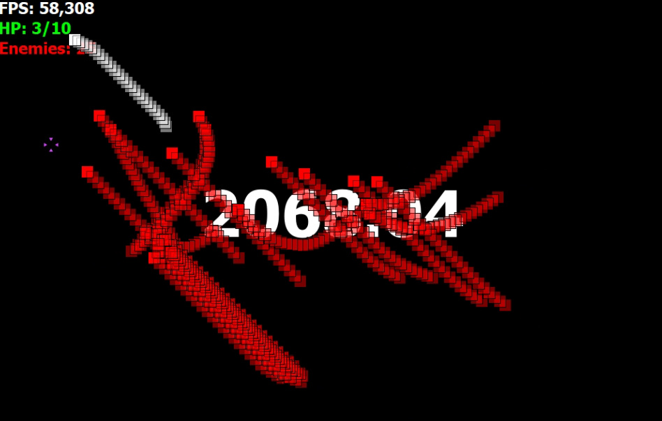
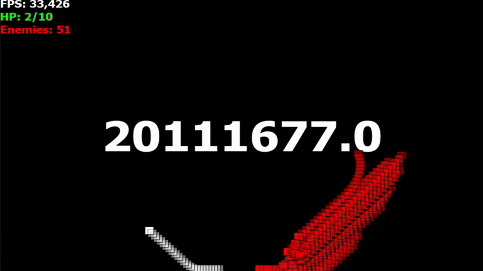

<p align="center">
    
</p>
<h1 align="center">DotEXE</h1>

<p align="center">
    You're a square, pursued by squares. Made with PyQt5<br>
</p>

<p align="center">
    <a href="https://github.com/Floerianc/DotEXE/releases">
        
    </a>
    <a href="https://github.com/Floerianc/DotEXE/issues">
        
    </a>
    <a href="https://github.com/Floerianc/DotEXE/stargazers">
        
    </a>
</p>

---

## ℹ️ About

**DotEXE** is a fast-paced survival game where you control a white square, evading waves of enemies that relentlessly pursue you. The game features:

- **Enemy AI**: Enemies mercilessly pursuing you.
- **Visual Effects**: Smooth motion trails and warning indicators enhance gameplay.
- **Wave System**: Increasing difficulty with each new enemy wave.
- **Minimalist Design**: Clean visuals focusing on simple gameplay mechanics.

_Try beating my record: **4,788,867,552.84**_ ;)

---

## 🖥️ Media

<p align="center">
    
    
</p>

---

## 🚀 Getting Started

### Prerequisites

- Python 3.8 or higher
- PyQt5

### 🛠️ Installation

```bash
git clone https://github.com/Floerianc/DotEXE.git
cd DotEXE
pip install -r requirements.txt
python main.py
```

<p align="center">

</p>

<p align="center">
    Built with ❤️ by <a href="https://github.com/Floerianc">Floerianc</a> 
</p>